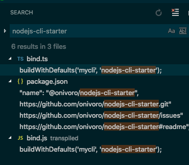
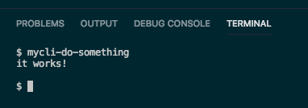

# nodejs-cli-starter

## How to use this repo

1. *command line*: `git clone https://github.com/onivoro/nodejs-cli-starter.git`

1. *command line*: `cd nodejs-cli-starter && rm -rf .git && git init`

1. *bind.ts*: change `mycli` to your new program name and change `nodejs-cli-starter` to the project root foldername.

1. *package.json*: find and replace the `name` property with the npm package name (include scope if applicable) and replace `https://github.com/onivoro/nodejs-cli-starter` with the project repo url. Change the author as well.

    

1. *command line*: `npm link`

1. Run your program on the command line as `program-kebab-cased-file-name` like this:

    

